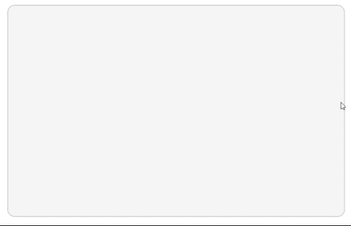

# MotionGraphics_AmericasNLP2024
These are the animations I was asked to create for AmericasNLP 2024. Their purpose was to provide competitors with a visual example of how their natural language processing model should work, accompanied by a brief explanation. These animations were created using After Effects and Photoshop. Additionally, the BodyMovin plugin was used to export the animations.

  

